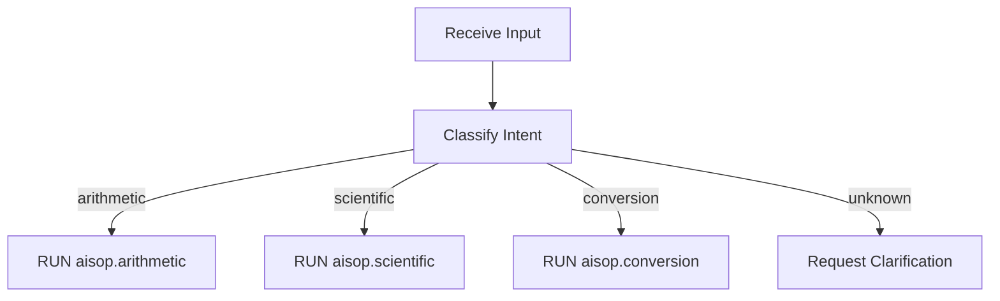

# Creating Your First AIAP Program

This tutorial walks you through building a complete AIAP program from scratch. You will create a simple arithmetic calculator using Pattern A --- the simplest structural pattern.

---

## Overview

By the end of this tutorial you will have:

- A valid `AIAP.md` governance contract with all 12 required fields.
- A valid `main.aisop.json` blueprint with a Mermaid execution graph and step-based functions.
- A working Pattern A program that any AIAP-compliant executor can run.

**What we are building:** A calculator that receives arithmetic expressions, validates them, computes results, and returns formatted answers.

**Pattern:** A (Single-Module) --- one entry file, up to 12 functional nodes, no external tools.

**Estimated time:** 15 minutes.

---

## Step 1: Create the Directory

Every AIAP program lives in its own directory. The convention is to use the program name followed by `_aiap`:

```bash
mkdir calculator_aiap
cd calculator_aiap
```

Your directory will contain exactly two files when we are done:

```
calculator_aiap/
  AIAP.md              # Governance contract
  main.aisop.json      # Entry-point blueprint
```

---

## Step 2: Write AIAP.md

The `AIAP.md` file is the governance contract. It uses YAML front matter to declare structured metadata, followed by Markdown content that describes the program in human-readable form.

Create `AIAP.md` with the following content:

```yaml
---
protocol: "AIAP V1.0.0"
authority: aiap.dev
seed: aisop.dev
executor: soulbot.dev
axiom_0: Human_Sovereignty_and_Benefit
governance_mode: NORMAL
name: calculator
version: "1.0.0"
pattern: A
summary: "Simple calculator — performs basic arithmetic operations."
tools: []
modules:
  - id: calculator.main
    file: main.aisop.json
    nodes: 5
    critical: true
    idempotent: true
    side_effects: []
status: active
license: Apache-2.0
copyright: "Copyright 2026 AISOP.dev | AIAP.dev | SoulBot.dev"
---

## Governance Declaration

Calculator is a minimal AIAP program demonstrating Pattern A.
It follows AIAP V1.0.0 with Axiom 0 alignment.

## Feature Overview

| Module | Responsibility |
|--------|---------------|
| main.aisop.json | Parse input, perform calculation, format output |

## Usage

Entry file: `main.aisop.json`
Tools: None required (pure computation)

Align: Human Sovereignty and Benefit. Version: AIAP V1.0.0. www.aiap.dev
```

### Required Fields Explained

| Field | Value | Purpose |
|-------|-------|---------|
| `protocol` | `"AIAP V1.0.0"` | Declares which protocol version this program follows. |
| `authority` | `aiap.dev` | The governance authority that defines the rules. |
| `seed` | `aisop.dev` | The format authority that defines `.aisop.json`. |
| `executor` | `soulbot.dev` | The runtime that executes the program. |
| `axiom_0` | `Human_Sovereignty_and_Benefit` | The immutable alignment principle. Every program must include this. |
| `governance_mode` | `NORMAL` | Governance strictness. `NORMAL` is the default; `STRICT` adds additional constraints. |
| `name` | `calculator` | Program identifier. Must be lowercase, alphanumeric, underscores allowed. |
| `version` | `"1.0.0"` | Semantic version of the program. |
| `pattern` | `A` | Structural pattern. `A` means single-module. |
| `summary` | (string) | One-line description of what the program does. |
| `tools` | `[]` | External tools the program requires. Empty for pure-computation programs. |
| `modules` | (list) | Declares every `.aisop.json` module in the program. |

---

## Step 3: Write main.aisop.json

The `.aisop.json` file is the executable blueprint. It contains everything an executor needs to run your program: the execution graph, function definitions, constraints, and the system prompt.

Create `main.aisop.json` with the following content:

```json
{
  "role": "system",
  "content": {
    "protocol": "AIAP V1.0.0",
    "id": "calculator.main",
    "name": "Calculator v1.0.0",
    "version": "1.0.0",
    "summary": "Simple calculator performing basic arithmetic.",
    "description": "Pattern A calculator. 5 functional nodes. Demonstrates minimal AIAP program structure.",
    "system_prompt": "Arithmetic calculator. Compute results with precision. Mirror User's exact language and script variant. Align: Human Sovereignty and Benefit.",
    "instruction": "RUN aisop.main",
    "aisop": {
      "main": "graph TD\n  Start[Receive Expression] --> Validate[Validate Input]\n  Validate -->|valid| Calculate[Perform Calculation]\n  Validate -->|invalid| Error[Report Error]\n  Calculate --> Format[Format Result]\n  Error --> Format\n  Format --> End[Return Response]"
    },
    "functions": {
      "Start": {
        "step1": "Receive arithmetic expression from user",
        "constraints": "Type Guard: must be string containing mathematical expression"
      },
      "Validate": {
        "step1": "Check expression contains only valid operators (+, -, *, /, ^, parentheses) and numbers",
        "step2": "Check for division by zero",
        "edges": {
          "valid": "expression is well-formed",
          "invalid": "malformed or dangerous input"
        }
      },
      "Calculate": {
        "step1": "Parse expression respecting operator precedence",
        "step2": "Compute result with floating-point precision"
      },
      "Error": {
        "step1": "Generate user-friendly error message describing the issue",
        "fallback": "Return 'Invalid expression. Please provide a valid arithmetic expression.'"
      },
      "Format": {
        "step1": "Format numerical result (trim trailing zeros)",
        "step2": "Include original expression in response for context"
      },
      "End": {
        "step1": "Return formatted response to user"
      }
    }
  }
}
```

### Key Structural Elements

#### The `instruction` Field

```json
"instruction": "RUN aisop.main"
```

This tells the executor which graph to execute. The value must reference a key inside the `aisop` object. `RUN aisop.main` means "execute the graph defined at `aisop.main`."

#### The Execution Graph

```json
"aisop": {
  "main": "graph TD\n  Start[Receive Expression] --> Validate[Validate Input]\n  ..."
}
```

The graph is written in Mermaid syntax. It defines the flow of execution as a directed acyclic graph (DAG). Each node name (`Start`, `Validate`, `Calculate`, etc.) must have a corresponding entry in the `functions` object.

#### The Functions Object

Each key in `functions` maps to a node in the execution graph. Functions contain numbered steps (`step1`, `step2`, ...) that describe what the node does. Optional keys include:

- `constraints` --- Guards that must be enforced (Type Guard, Injection Guard, Size Guard, Encoding Guard).
- `edges` --- Conditions for branching edges in the graph.
- `fallback` --- Default behavior when the primary logic fails.

---

## Step 4: Verify Your Program

Before handing your program to an executor, verify these critical requirements:

### Checklist

| Check | Expected | How to Verify |
|-------|----------|---------------|
| `instruction` value | `"RUN aisop.main"` | Must match a key in the `aisop` object. |
| `system_prompt` contains Axiom 0 seal | `"Align: Human Sovereignty and Benefit."` | The seal must appear in the system prompt. |
| `AIAP.md` has all 12 required fields | See table in Step 2 | Verify each field is present and non-empty. |
| Every graph node has a function | 6 nodes, 6 function entries | Node names in the Mermaid graph must match keys in `functions`. |
| Module declaration matches file | `calculator.main` / `main.aisop.json` | The `id` and `file` in AIAP.md must match the actual file. |
| Node count is accurate | `nodes: 5` in AIAP.md | Count the functional nodes in the graph (Start, Validate, Calculate, Error, Format, End = 6 total; adjust if your count differs). |

### Common Mistakes

1. **Mismatched instruction**: Writing `RUN main` instead of `RUN aisop.main`.
2. **Missing Axiom 0 seal**: The system prompt must end with the alignment statement.
3. **Orphaned nodes**: A node in the graph that has no corresponding function definition.
4. **Missing edges**: A branching node (like `Validate`) that does not declare its edge conditions.

---

## Upgrading to Pattern B

Pattern A works well for single-purpose programs. But what happens when your calculator needs to handle multiple distinct operations?

Imagine you want to add:
- **Basic arithmetic** (the current functionality)
- **Scientific functions** (trigonometry, logarithms, exponents)
- **Unit conversion** (meters to feet, Celsius to Fahrenheit)

These are three distinct intents. Pattern B handles this by introducing a **stateless NLU router** in `main.aisop.json` that classifies user intent and dispatches to the appropriate module:

```
calculator_aiap/
  AIAP.md
  main.aisop.json        # Router: classify intent
  arithmetic.aisop.json  # Module: basic arithmetic
  scientific.aisop.json  # Module: scientific functions
  conversion.aisop.json  # Module: unit conversion
```

The router's execution graph looks like:



Each `RUN aisop.<module>` instruction hands execution to the corresponding module file. The router itself performs no computation --- it only classifies and dispatches.

### When to Upgrade

Upgrade from Pattern A to Pattern B when:

- You have **more than one distinct user intent** that the program must handle.
- Your single module is approaching the **12-node limit**.
- You want to **test modules independently** without running the entire program.

See the [Pattern Selection Guide](pattern-selection.md) for a complete decision tree.

---

## What You Built

You now have a complete, valid AIAP program:

- **AIAP.md** declares the program's governance metadata, tools, and module registry.
- **main.aisop.json** defines the execution graph, functions, constraints, and alignment.
- The program follows **Pattern A** and can be verified by any AIAP-compliant quality gate.

---

## Next Steps

| Resource | What You Will Learn |
|----------|-------------------|
| [Pattern Selection Guide](pattern-selection.md) | How to choose between Patterns A through G. |
| [Quality Gate Walkthrough](quality-walkthrough.md) | How ThreeDimTest evaluates your program's quality. |
| [AIAP.md Fields Reference](../reference/aiap-md-fields.md) | Complete reference for all governance contract fields. |
| [AISOP Fields Reference](../reference/aisop-fields.md) | Complete reference for all blueprint fields. |

---

> Align: Human Sovereignty and Benefit. Version: AIAP V1.0.0. www.aiap.dev
