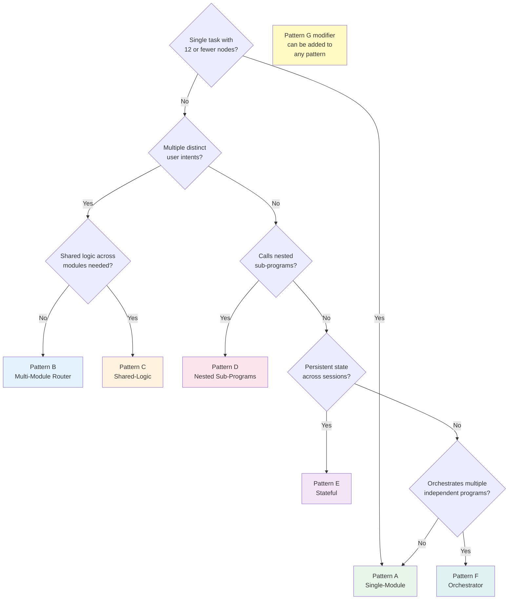

# Pattern Selection Guide

AIAP defines seven structural patterns (A through G) that govern how AI programs are organized. This guide helps you choose the right pattern for your use case.

---

## Quick Reference

Use this table to find your pattern based on your scenario:

| Scenario | Pattern | Example |
|----------|---------|---------|
| Single task, simple flow | **A** | Calculator, translator, summarizer |
| Multiple user intents | **B** | Expense tracker, customer service bot |
| Shared logic across modules | **C** | Multi-language app with shared i18n module |
| Program calls other programs | **D** | Research assistant that invokes specialized sub-agents |
| Persistent state across sessions | **E** | Learning tutor that tracks student progress |
| Multi-program coordination | **F** | Enterprise workflow orchestrating multiple AIAP programs |
| Executable tool code bundled | **G** (modifier) | Any pattern that ships its own tool implementations |

---

## Decision Flowchart

Use this flowchart to walk through the decision process:



### Reading the Flowchart

Start at the top. Answer each question honestly about your program's requirements. The first "Yes" path that matches your needs gives you the base pattern. Then consider whether Pattern G (embedded tool code) should be added as a modifier.

---

## Pattern Comparison

| Pattern | Description | Max Nodes per Module | Directory Structure | Primary Use Case |
|---------|-------------|---------------------|---------------------|-----------------|
| **A** | Single-Module | 12 | `AIAP.md` + `main.aisop.json` | Simple, single-purpose tasks |
| **B** | Multi-Module Router | 12 per module | `AIAP.md` + `main.aisop.json` + `*.aisop.json` modules | Multiple intents with stateless routing |
| **C** | Shared-Logic | 12 per module | Pattern B + `shared/` directory | Cross-module utilities (logging, i18n, validation) |
| **D** | Nested Sub-Programs | 12 per module | Pattern B/C + `sub_programs/` directory | Parent-child program composition |
| **E** | Stateful | 12 per module | Pattern B/C + `state/` schema definitions | Session persistence, memory, learning |
| **F** | Orchestrator | 12 per module | Conductor program + references to external AIAP programs | Multi-program workflows and pipelines |
| **G** | Embedded Tool Code | 12 per module | Any pattern + `tools/` directory with executable code | Self-contained programs that ship their own tool implementations |

### Node Limits

Every individual module is limited to **12 functional nodes**. This is a hard constraint enforced by quality rule C5. If a single module exceeds 12 nodes, you must split it into multiple modules (upgrade to Pattern B or higher).

---

## Pattern Details

### Pattern A --- Single-Module

The simplest pattern. One `AIAP.md` and one `main.aisop.json`. Best for focused, single-purpose programs.

```
my_program_aiap/
  AIAP.md
  main.aisop.json
```

**Choose A when:** Your program does one thing, the execution graph has 12 or fewer nodes, and you need no external state or sub-programs.

### Pattern B --- Multi-Module Router

Adds a stateless NLU router in `main.aisop.json` that classifies user intent and dispatches to specialized modules.

```
my_program_aiap/
  AIAP.md
  main.aisop.json       # Router
  module_a.aisop.json   # Specialized module
  module_b.aisop.json   # Specialized module
```

**Choose B when:** Your program handles multiple distinct intents and each intent has its own execution flow.

### Pattern C --- Shared-Logic

Extends Pattern B with shared utility modules that multiple modules can reference.

```
my_program_aiap/
  AIAP.md
  main.aisop.json
  module_a.aisop.json
  module_b.aisop.json
  shared/
    logging.aisop.json
    i18n.aisop.json
```

**Choose C when:** Multiple modules duplicate the same logic (logging, validation, internationalization) and you want to centralize it.

### Pattern D --- Nested Sub-Programs

A parent AIAP program invokes child AIAP programs. Each child is a self-contained program with its own `AIAP.md`.

**Choose D when:** Your program delegates entire tasks to other AIAP programs that can also run independently.

### Pattern E --- Stateful

Adds persistent state management. The program can remember context across sessions using declared state schemas.

**Choose E when:** Your program needs to learn, remember user preferences, or maintain context across multiple sessions.

### Pattern F --- Orchestrator

A conductor program that coordinates multiple independent AIAP programs. Unlike Pattern D (parent-child), Pattern F programs are peers orchestrated by a central conductor.

**Choose F when:** You are building an enterprise workflow that chains multiple independent AIAP programs together.

### Pattern G --- Embedded Tool Code (Modifier)

A modifier that can be applied to any base pattern. It bundles executable tool code alongside the blueprint so that the program is fully self-contained.

**Choose G when:** Your program relies on custom tools that are not available in the executor's environment, and you want to ship the tool implementations with the program.

---

## Combination Patterns

Pattern G is a modifier and can be combined with any base pattern:

| Combination | Description | Use Case |
|-------------|-------------|----------|
| **A+G** | Single-module with embedded tools | Self-contained utility that ships its own code |
| **B+G** | Multi-module router with embedded tools | Multi-intent program with custom tool implementations |
| **D+G** | Nested sub-programs with embedded tools | Parent program that provides tools to its children |
| **E+G** | Stateful with embedded tools | Persistent program with custom state management code |
| **F+G** | Orchestrator with embedded tools | Enterprise conductor with custom integration code |

---

## When to Upgrade

Patterns are not permanent. As your program evolves, you may need to upgrade to a more capable pattern. Here are the trigger conditions:

| Current Pattern | Trigger Condition | Upgrade To |
|----------------|-------------------|------------|
| **A** | More than one distinct user intent | **B** |
| **A** | Module approaching 12-node limit | **B** (split into modules) |
| **B** | Duplicated logic across 2+ modules | **C** |
| **B** or **C** | Need to invoke another AIAP program | **D** |
| **B** or **C** | Need to persist state across sessions | **E** |
| **D** or **E** | Orchestrating 3+ independent programs | **F** |
| Any | Need to ship custom tool code | Add **G** modifier |

### Migration Checklist

When upgrading patterns:

1. Update `pattern` in `AIAP.md` to the new pattern letter.
2. Add new module entries to the `modules` list in `AIAP.md`.
3. Update node counts to reflect any changes.
4. If adding tools, declare them in the `tools` list and set appropriate `trust_level`.
5. Run ThreeDimTest to verify the upgraded program passes all quality gates.

---

> Align: Human Sovereignty and Benefit. Version: AIAP V1.0.0. www.aiap.dev
