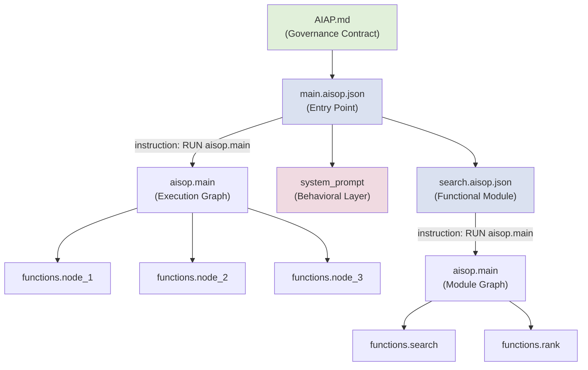

# Core Concepts

This document provides a detailed walkthrough of the foundational concepts that underpin
the AI Application Protocol (AIAP). It covers naming conventions, program structure, the
governance contract, file anatomy, invariants, and quality measurement. Readers should be
familiar with the high-level overview presented in
[What is AIAP?](what-is-aiap.md) before proceeding.

---

## AISOP and AIAP -- Naming Conventions

The AIAP ecosystem uses a precise naming convention to distinguish between formats,
programs, and declarations. Understanding these names is essential for navigating any
AIAP-governed project.

### .aisop.json -- The Language Format

Any file ending in `.aisop.json` is an **AISOP file** -- a structured JSON document that
expresses AI program logic. The `.aisop.json` extension signals that the file conforms to
the AISOP schema defined by [aisop.dev](https://www.aisop.dev). It is the **language** in
which AI programs are written.

Examples: `main.aisop.json`, `search.aisop.json`, `summarize.aisop.json`.

### _aiap -- The Program Type

Any directory whose name ends in `_aiap` is an **AIAP program directory** -- a
self-contained, governed AI program. The `_aiap` suffix declares that the contents of the
directory are subject to AIAP governance rules: structural validation, quality gates, trust
level enforcement, and threat analysis.

Examples: `assistant_aiap/`, `code-reviewer_aiap/`, `data-pipeline_aiap/`.

### AIAP.md -- The Project Declaration

Every AIAP program directory contains exactly one `AIAP.md` file at its root. This file
serves as the **project declaration** -- the single point of discovery, metadata, and
governance commitment for the program.

The role of `AIAP.md` is analogous to declaration files in other ecosystems:

| Ecosystem | Declaration File | Purpose |
|-----------|-----------------|---------|
| Python | `pyproject.toml` | Project metadata, dependencies, build config |
| Java/Maven | `pom.xml` | Project object model, dependencies, plugins |
| Node.js | `package.json` | Package metadata, scripts, dependencies |
| Rust | `Cargo.toml` | Package metadata, dependencies, features |
| **AIAP** | **`AIAP.md`** | **Governance contract, metadata, program entry** |

---

## The AIAP Program

An AIAP program is a directory -- suffixed with `_aiap` -- that contains everything
required to define, govern, and execute an AI application. At minimum, every AIAP program
contains:

```
my-assistant_aiap/
  AIAP.md              # Governance contract (required)
  main.aisop.json      # Entry point (required)
  search.aisop.json    # Functional module (optional)
  format.aisop.json    # Functional module (optional)
```

### AIAP.md -- The Governance Contract

The single source of truth for program identity, governance metadata, and human-readable
documentation. Described in detail in the next section.

### main.aisop.json -- The Entry Point

The program's execution entry point. Every AIAP program must have exactly one
`main.aisop.json` at the root of its `_aiap` directory. This is the file that a runtime
loads first when executing the program.

### Functional Modules

Additional `.aisop.json` files that implement specific capabilities. These modules are
referenced from the execution graph defined in `main.aisop.json` and are invoked as
functional nodes during program execution.

---

## The Governance Contract (AIAP.md)

The `AIAP.md` file is the **discovery entry point** for any AIAP program. When a runtime,
registry, or human encounters an `_aiap` directory, `AIAP.md` is the first file read. It
combines structured metadata (YAML frontmatter) with human-readable documentation
(Markdown body).

### YAML Frontmatter -- The 12 Required Fields

The frontmatter block contains exactly **12 required fields**, divided into two categories:

#### Governance Fields (6)

These fields establish the program's governance posture:

| Field | Type | Description |
|-------|------|-------------|
| `aiap_version` | string | The AIAP specification version the program conforms to (e.g., `"1.0.0"`). |
| `trust_level` | string | The program's trust tier: `T1`, `T2`, `T3`, or `T4`. |
| `structural_pattern` | string | The program's structural pattern: `A` through `G`. |
| `quality_target` | string | The target ThreeDimTest grade: `S`, `A`, `B`, `C`, `D`. |
| `threat_model` | list | Applicable threat categories from the AT1--AT6 taxonomy. |
| `axiom_alignment` | string | Must be `"Axiom 0: Human Sovereignty and Benefit"`. |

#### Project Fields (6)

These fields provide standard project metadata:

| Field | Type | Description |
|-------|------|-------------|
| `name` | string | The program's human-readable name. |
| `version` | string | Semantic version of the program (e.g., `"1.0.0"`). |
| `description` | string | One-line summary of the program's purpose. |
| `author` | string | Program author or maintaining organization. |
| `license` | string | SPDX license identifier (e.g., `"MIT"`, `"Apache-2.0"`). |
| `entry_point` | string | Path to the main AISOP file (always `"main.aisop.json"`). |

### Example Frontmatter

```yaml
---
# Governance
aiap_version: "1.0.0"
trust_level: T2
structural_pattern: C
quality_target: A
threat_model: [AT1, AT3]
axiom_alignment: "Axiom 0: Human Sovereignty and Benefit"

# Project
name: "Research Assistant"
version: "2.1.0"
description: "An AI assistant for academic literature review and synthesis."
author: "Example Organization"
license: "Apache-2.0"
entry_point: "main.aisop.json"
---
```

### Markdown Body

Below the frontmatter, the Markdown body contains three sections:

1. **Governance Declaration** -- A human-readable statement of the program's governance
   commitments, trust level rationale, and threat model justification.
2. **Feature Overview** -- A summary of the program's capabilities, organized by
   functional module.
3. **Usage** -- Instructions for loading, configuring, and running the program.

The Markdown body is not parsed by runtimes for execution purposes, but it **is** indexed
by registries for discovery and by auditors for governance review.

---

## AISOP File Structure

Every `.aisop.json` file follows a consistent top-level structure built around the
`role/content` JSON pattern.

### Top-Level Schema

```json
{
  "role": "aisop",
  "content": {
    "instruction": "RUN aisop.main",
    "system_prompt": "...",
    "aisop.main": "...",
    "functions": {
      "node_1": "...",
      "node_2": "...",
      "node_3": "..."
    }
  }
}
```

### Field Breakdown

#### role

Always `"aisop"`. This identifies the file as an AISOP document to any parser or runtime.

#### content.instruction

Always `"RUN aisop.main"`. This is an **immutable constant** -- it never changes, it is
never customized, and its purpose is explained in detail in the next section.

#### content.system_prompt

The behavioral layer of the program. This field contains natural-language instructions that
shape the model's behavior during execution. It is the *only* place where behavioral
guidance belongs. Detailed rules for `system_prompt` content are provided in a later
section.

#### content.aisop.main

The **execution graph** -- a Mermaid flowchart that defines the program's control flow.
This graph declares which functional nodes exist, how they connect, and in what order they
execute. The execution graph is the structural backbone of the program.

Example:

```
graph TD
    START([Start]) --> A[Receive Query]
    A --> B[Search Sources]
    B --> C{Results Found?}
    C -->|Yes| D[Synthesize Answer]
    C -->|No| E[Request Clarification]
    D --> F[Format Response]
    E --> F
    F --> END([End])
```

#### content.functions

A JSON object whose keys are **node names** and whose values are the **functional logic**
for each node. Every node referenced in the `aisop.main` execution graph must have a
corresponding entry in `functions`. Each function defines a single, discrete unit of work.

---

## The Instruction Invariant

The `instruction` field in every `.aisop.json` file is always:

```json
"instruction": "RUN aisop.main"
```

This is not a convention. It is an **invariant** -- an immutable constant that must never
be altered. The value exists for a precise architectural reason: **execution always enters
through the execution graph.**

### Why an Invariant?

Consider how other systems handle entry points:

| System | Entry Mechanism | Invariant |
|--------|----------------|-----------|
| C | `int main()` | The program always starts at `main`. |
| Dockerfile | `RUN`, `CMD`, `ENTRYPOINT` | The container executes the declared command. |
| SQL | `SELECT` | A query always begins with a selection operation. |
| **AISOP** | `RUN aisop.main` | **The program always executes the main graph.** |

In C, one does not choose a different function as the entry point for each build. In SQL,
one does not replace `SELECT` with a custom keyword. Similarly, in AISOP, the instruction
is fixed: execution begins at `aisop.main`, always.

This invariant provides three guarantees:

1. **Predictability.** Any runtime loading any `.aisop.json` file knows exactly where
   execution begins. There is no ambiguity, no configuration, no conditional entry.

2. **Auditability.** An auditor reviewing an AIAP program can trace every execution path
   from a single, known starting point. If the instruction could vary, the auditor would
   need to enumerate every possible entry point -- an unbounded problem.

3. **Integrity.** If the instruction field contains anything other than `"RUN aisop.main"`,
   the file is invalid. This provides a trivial, instant integrity check: one field, one
   expected value, pass or fail.

---

## system_prompt Rules

The `system_prompt` field is the behavioral layer of an AISOP file. It shapes how the
model acts during execution -- its persona, its constraints, its communication style. AIAP
defines strict rules for what a `system_prompt` must and must not contain.

### Required Content

Every `system_prompt` must include the following:

| Requirement | Purpose | Example |
|-------------|---------|---------|
| **Role Positioning** | Establishes the model's identity and domain | `"You are a research assistant specializing in climate science."` |
| **Domain Guidelines** | Defines the boundaries of acceptable behavior | `"Only cite peer-reviewed sources published after 2015."` |
| **Mirror User's Language** | Ensures the model responds in the user's language | `"Mirror User's language."` |
| **Axiom 0 Alignment** | Declares commitment to the foundational axiom | `"Align: Human Sovereignty and Benefit."` |

The "Mirror User's language" directive ensures that AIAP programs are inherently
multilingual without requiring per-language configuration. The model detects the user's
language and responds in kind.

The "Align: Human Sovereignty and Benefit" statement is not decorative. It is a governance
marker that binds the program to Axiom 0 -- the non-negotiable principle that AI systems
must serve human interests.

### Prohibited Content

The following must **never** appear in a `system_prompt`:

| Prohibition | Rationale |
|-------------|-----------|
| **Product name** | The system_prompt defines behavior, not branding. Product identity belongs in `AIAP.md`. |
| **Version number** | Version metadata belongs in `AIAP.md` frontmatter. Embedding it in the prompt creates synchronization risk. |
| **Architecture details** | Internal structure (file names, module layout, node counts) is expressed by the execution graph, not the prompt. |
| **File names** | References to specific `.aisop.json` files create brittle coupling between the prompt and the file system. |

The principle is separation of concerns: `system_prompt` handles **behavior**; `AIAP.md`
handles **identity**; the execution graph handles **structure**. Mixing these layers
creates maintenance burden and governance ambiguity.

---

## Functional Nodes

A **functional node** is the smallest unit of work in an AIAP program. Each node
represents exactly one functional responsibility -- a single, well-defined task that the
program performs as part of its execution graph.

### What Counts as a Node?

A node is any entry in the `functions` object of an `.aisop.json` file that performs a
discrete operation. The count methodology is straightforward:

- Each key in `content.functions` is one node.
- Decision branches in the execution graph (e.g., `{Results Found?}`) that route to
  different nodes are structural connectors, not nodes themselves, unless they have
  corresponding function entries.
- Nodes in separate `.aisop.json` modules are counted independently per module.

### Node Count Guidelines

AIAP provides progressive guidelines for node counts within a single `.aisop.json` file:

```
+---------------------+-------------------------------------------+
|  Node Count Range   |  Guidance                                 |
+---------------------+-------------------------------------------+
|  3 -- 12 nodes      |  Normal operating range. No action needed.|
+---------------------+-------------------------------------------+
|  13 -- 15 nodes     |  Advisory. Consider splitting into        |
|                     |  multiple modules for clarity.             |
+---------------------+-------------------------------------------+
|  16+ nodes          |  Recommended split. The module is likely   |
|                     |  handling too many responsibilities.       |
+---------------------+-------------------------------------------+
```

These are guidelines, not hard limits. The governance concern is **cognitive load and
auditability**: a module with 25 nodes is difficult for a human reviewer to reason about,
and difficult for automated tools to validate exhaustively.

### The fractal_exempt Marker

Some modules legitimately require a higher node count. An orchestration module that
coordinates many sub-tasks, for example, may need 20+ nodes without any single node being
decomposable further. For these cases, AIAP provides the `fractal_exempt` marker.

When a module is marked `fractal_exempt`, it is excluded from node count advisories. The
marker must be justified in the `AIAP.md` governance declaration -- a bare `fractal_exempt`
without rationale is a governance violation.

```json
{
  "role": "aisop",
  "content": {
    "instruction": "RUN aisop.main",
    "fractal_exempt": true,
    "fractal_exempt_rationale": "Orchestration hub coordinating 8 downstream modules.",
    "system_prompt": "...",
    "aisop.main": "...",
    "functions": { }
  }
}
```

---

## Quality Dimensions -- ThreeDimTest

AIAP measures program quality along three independent dimensions, collectively known as the
**ThreeDimTest**. Each dimension is scored on a 0.0--5.0 scale.

### The Three Dimensions

#### Correctness (C)

Does the program produce **correct** outputs? Correctness measures factual accuracy,
logical consistency, and adherence to the stated task. A program that generates plausible
but wrong answers scores low on Correctness regardless of how well it is written or how
detailed its output is.

**Evaluation focus:** Factual accuracy, logical validity, task completion, absence of
hallucination.

#### Intrinsic Quality (I)

Is the program **well-built**? Intrinsic Quality measures the structural soundness of the
program itself -- independent of any specific input or output. This includes code
organization, adherence to AIAP structural patterns, node decomposition, system_prompt
compliance, and governance contract completeness.

**Evaluation focus:** Structural patterns, node hygiene, system_prompt rules, AIAP.md
completeness, execution graph clarity.

#### Detail (D)

Is the output **sufficiently detailed**? Detail measures the depth, nuance, and
thoroughness of the program's responses. A program that gives correct but superficial
one-line answers scores low on Detail. A program that provides rich, contextualized,
well-structured responses scores high.

**Evaluation focus:** Response depth, contextual richness, formatting quality, coverage
of edge cases.

### Grading Scale

The three dimension scores are combined and graded according to the following scale:

| Grade | Minimum Score | Interpretation |
|-------|--------------|----------------|
| **S** | >= 4.5 | Exceptional. Exceeds governance requirements. |
| **A** | >= 3.5 | Strong. Meets all governance requirements with distinction. |
| **B** | >= 2.5 | Acceptable. Meets minimum governance requirements. |
| **C** | >= 1.5 | Below standard. Requires improvement before certification. |
| **D** | >= 0.5 | Poor. Significant governance gaps identified. |
| **F** | < 0.5 | Failing. Does not meet minimum governance thresholds. |

A program seeking T3 or T4 trust level certification must achieve at least an **A** grade
across all three dimensions. Programs at T1 and T2 are not grade-gated but are encouraged
to self-assess using ThreeDimTest as a development tool.

### Example Assessment

```
Program: research-assistant_aiap v2.1.0
-------------------------------------------
Correctness (C):       4.2 / 5.0
Intrinsic Quality (I): 4.6 / 5.0
Detail (D):            3.8 / 5.0
-------------------------------------------
Average:               4.20 / 5.0
Grade:                 A
-------------------------------------------
```

---

## Putting It All Together

The following diagram illustrates how the core concepts relate to each other within a
single AIAP program:



Every concept described in this document -- naming conventions, directory structure,
governance contracts, file anatomy, the instruction invariant, system_prompt rules,
functional nodes, and quality dimensions -- works together to produce AI programs that are
**predictable**, **auditable**, and **trustworthy**.

---

## Next Steps

- Review the full AIAP specification at [aiap.dev](https://www.aiap.dev).
- Explore Structural Patterns A through G in the
  [Structural Patterns Guide](structural-patterns.md).
- Learn about Trust Levels T1 through T4 in the [Trust Levels Guide](trust-levels.md).
- Understand the Threat Taxonomy AT1 through AT6 in the
  [Threat Taxonomy Guide](threat-taxonomy.md).

---

> **Align: Human Sovereignty and Benefit.**
> Version: AIAP V1.0.0
> [www.aiap.dev](https://www.aiap.dev)
